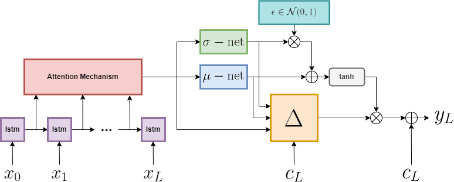
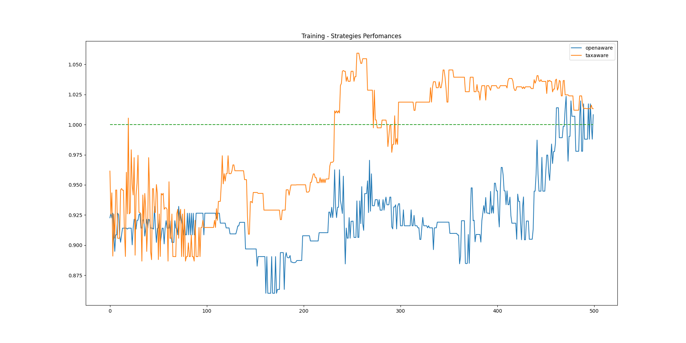
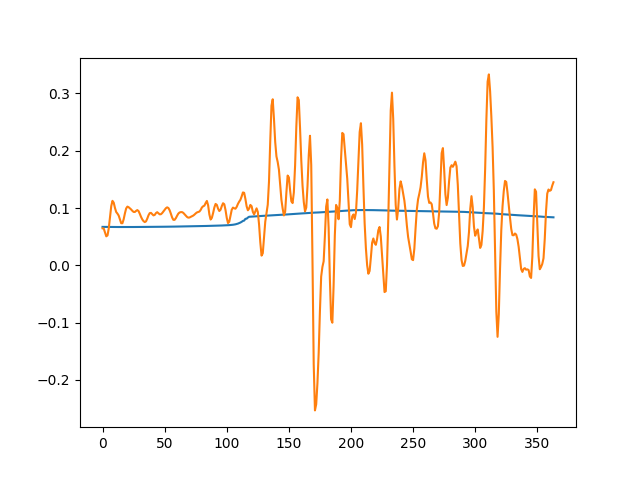

# Stochastic Attention Based LSTM for Stock prices Forecasting.

## Architecture
This model is based on daily traiding and it never keeps a position overnight. Hereafter it is shown the model architecture.

<p align="center">
  
</p>

The stochasticity is relvant only in the prediction of the trend direction, the displacement value ( $\Delta$-close price ) is therefore deterministic.


## Metrics

The model considers fees (by default 0.1%) on both buying and selling positions. The PPM is the profitability performance measure that clarify when the model, net of fees, is more profitable of the buy&hold strategy. If PPM>1 the model is therefore useful. In particular, the next figure shows the PPM of two buy-policies on a test dataset at training time.

<p align="center">
  
</p>


## Features
It is reasonable to set the SALSTM into deterministc mode once it is deployed, but nonetheless we can still exploit its distribution parameters. The $\sigma$ value can be seen as measure of the model uncertainty and can be used at inference time estimate local volatility. Therefore we can exploit this to define a buy-policy that depends also on how much the model feels the prediction risky. The following figure shows the $\sigma$ values (blue) vs the $\Delta$-close prices (orange) of the stock. 

<p align="center">
  
</p>


## Code Structure

The overall code structure is generated by means of this [template](https://github.com/grok-ai/nn-template).

```bash
.
├── .cache              
├── conf                # hydra compositional config 
│   ├── data
│   ├── default.yaml    # current experiment configuration        
│   ├── hydra
│   ├── logging
│   ├── model
│   ├── optim
│   └── train
├── data                # datasets
├── .env                # system-specific env variables, e.g. PROJECT_ROOT
├── requirements.txt    # basic requirements
├── src
│   ├── common          # common modules and utilities
│   ├── pl_data         # PyTorch Lightning datamodules and datasets
│   ├── pl_modules      # PyTorch Lightning modules
│   ├── run.py          # entry point to run current conf
│   └── ui              # interactive streamlit apps
└── wandb               # local experiments (auto-generated)
```
